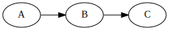
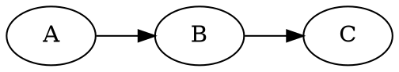

# md-code-renderer

Renders code blocks in Markdown files into images, and inlines the images in the file.

- Supported languages: `dot`, `plantuml`

This is an experimental program for use in my knowledge base. The goal is to
have code blocks containing diagramming DSLs, and be able to render them into
inline images. There are a few existing implementations, but none of them do
what I want. Most _replace_ the code block, whereas I want to inline the
rendered image _alongside_ the code block. This tool is fairly opinionated at
the moment. I may extend and generalize it in the future, though at the moment
it does what I need it to.

## Example

This readme has been processed by `md-code-renderer` to render the diagrams.

```bash
md-code-renderer render --languages dot --output-dir example/ --link-prefix "./example/" ./README.md
```

To mark a code block for rendering, add the `render` keyword to the opening fence.

    ```dot render
    digraph G {
        rankdir=LR;
        A -> B -> C;
    }
    ```

By default, the image will be rendered and placed above the code block.

    

    ```dot render
    digraph G {
        rankdir=LR;
        A -> B -> C;
    }
    ```

The `render` keyword supports options, which can be specified in the form
`render{"mode": "normal"}`. If no options are passed, the default mode is
`normal`.

Supported modes are:

- `normal`
- `code-collapsed`
- `image-collapsed`
- `code-hidden`

### `normal` mode

Image is placed above the code block.




### `code-collapsed` mode

Image is placed above the code block. Code block is collapsed.


<details><summary>Source</summary>


</details>

### `image-collapsed` mode

Code block is placed above the image. Image is collapsed.


<details><summary>Image</summary>


</details>

### `code-hidden` mode

The code block will be hidden in this mode. It will still be viewable in the
HTML source code as a HTML comment.


<!--

-->
