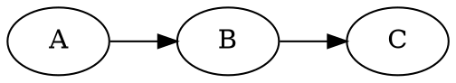
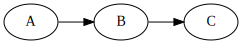
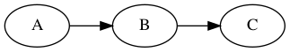
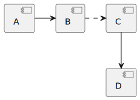
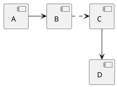

# md-code-renderer

Renders code blocks in Markdown files into images, and inlines the images in the file.

- Supported languages: `dot` (GraphViz), `plantuml`, `pikchr`

This is an experimental program for use in my knowledge base. The goal is to
have code blocks containing diagramming DSLs, and be able to render them into
inline images. There are a few existing implementations, but none of them do
what I want. Most _replace_ the code block, whereas I want to inline the
rendered image _alongside_ the code block. This tool is fairly opinionated at
the moment. I may extend and generalize it in the future, though at the moment
it does what I need it to.

## Features

- PlantUML, Graphviz, Pikchr diagrams
- SVG and PNG rendering
- Various output templates: `normal`, `code-collapsed`, `image-collapsed`, `code-hidden`
- Custom output filenames
- Images will only be re-rendered if the code block content has changed

## Usage

To mark a code block for rendering, add the `render` keyword to the opening fence.

    ```dot render
    digraph G {
        rankdir=LR;
        A -> B -> C;
    }
    ```

By default, the image will be rendered and placed above the code block.

    

    ```dot render
    digraph G {
        rankdir=LR;
        A -> B -> C;
    }
    ```

The `render` keyword supports options, which can be specified in the form
`render{"optionName": "value"}`. Supported options are:

- `mode`: The placement of rendered images. Supported modes: `normal`
  (default), `code-collapsed`, `image-collapsed`, `code-hidden`.
- `filename`: The filename of the rendered image. If not specified, the
  filename will be automatically generated as `render-{hash}.svg`.

## Examples

I recommend viewing the [raw
source](https://github.com/benjaminheng/md-code-renderer/blob/master/README.md?plain=1)
of this readme as well.

### `normal` mode

Image is placed above the code block.




### `code-collapsed` mode

Image is placed above the code block. Code block is collapsed.


<details><summary>Source</summary>


</details>

### `image-collapsed` mode

Code block is placed above the image. Image is collapsed.


<details><summary>Image</summary>


</details>

### `code-hidden` mode

The code block will be hidden in this mode. It will still be viewable in the
HTML source code as a HTML comment.


<!--

-->

### Custom filename

The options for this code block is: `{"filename":
"readme-example-custom-filename.svg"}`. The generated image will use this
filename.

```dot render{"mode": "image-collapsed", "filename": "readme-example-custom-filename.svg"}
digraph G {
    rankdir=LR;
    A -> B -> C;
}
```

<details><summary>Image</summary>

 <!-- hash:32455c4f -->

</details>

### Different output formats

If filename is specified, the output format is inferred from the file's
extension. In this example the filename has a `.png` extension, so a PNG image
is rendered.

```dot render{"mode": "image-collapsed", "filename": "readme-example-output-format-png.png"}
digraph G {
    rankdir=LR;
    A -> B -> C;
}
```

<details><summary>Image</summary>

 <!-- hash:32455c4f -->

</details>

### Supported languages

GraphViz:


<details><summary>Source</summary>


</details>

PlantUML:



<details><summary>Source</summary>



</details>

Pikchr:

 <!-- hash:27692842 -->

<details><summary>Source</summary>

```pikchr render{"mode": "code-collapsed", "filename": "readme-example-pikchr.svg"}
        scale = 0.9
R1:     box "README.md" fit
        arrow right
MD:     box "md-code-renderer" fit
        arrow right
R2:     box width 2cm height 80% "README.md" "(modified)"
IMG:    box "image.svg" width 2cm height 0.6cm at R2.s+(0,-1.2cm)
        line from MD.s down until even with IMG.w " outputs" ljust
        arrow right until even with IMG.w
        arrow dashed from R2.s down to IMG.n " references" ljust
```

</details>
