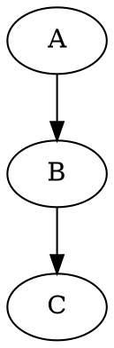

# Example

## Normal mode

```dot render
digraph G {
    A -> B -> C
}
```

```dot render{"mode": "normal"}
digraph G {
    A -> B -> C
}
```

## Code collapsed mode

Source

```dot render{"mode": "code-collapsed"}
digraph G {
    A -> B -> C
}
```

