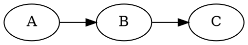

# Example

## Normal mode

## Code collapsed mode

Source

## Image collapsed mode

Image

## Code hidden mode

The code block will be hidden in this mode. It will still be viewable in in the
HTML source code as a HTML comment. The render directive for this code block is
`render{"mode": "code-hidden"}`.

<!--

-->
